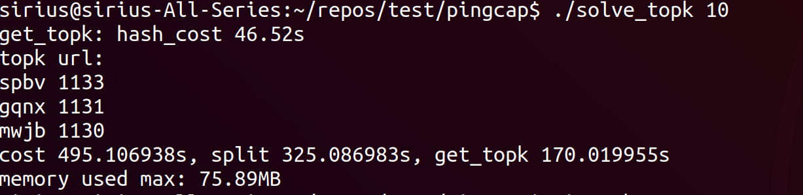
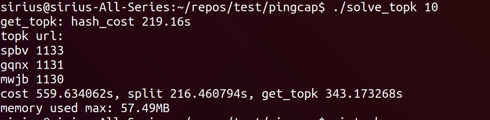

# TOPK

## SUMMARY

### Solution
**Divide and conquer**: Because of 1GB memory limit, we can't load 100GB url into memory at the same time. So we can split the raw URL input into 1000 shards, for each shard, in expectation, its size will be 100MB, which can be loaded into memory. Then we can get topk for each shard.
So the code is similar as following:
```
1. Split input into 1000 shards, make sure same urls are stored into the same shard
2. for each shard, use hash_map to calculate the count of every url and update current topk(priority_queue)
3. current topk is the answer
```

### Optimization

I try many strategies to improve performance, of which two strategies work very well:
1. **g++ compiler optimization level**, g++ -O2 or g++ -O3. It seems that unordered_map runs much faster when -O2 or -O3 is enabled.
2. **concurrent hash_map**: [cuckoohash_map](https://github.com/efficient/libcuckoo) replaces built-in [unordered_map](http://www.cplusplus.com/reference/unordered_map/unordered_map/).

Currently, for 10GB URL data(100GB too slow to run on my local machine), 100MB as the memory limit, it takes about 500s to solve topk problem, of which:
1. 450s read/write file. I think it is reasonable becuase 20GB read and 10GB write is necessary.
2. 50s hash_map cost.

In fact, hash_map operations and read 1000 shards(10GB read) can run in pipeline:
```
1. wait for the end of aio to read current shard into memory
2. issue asynchronous read of next shard
3. process current shard
```
Potentially 50s of  hash_map cost can be reduced in 10GB task, leading to 10% improvement. I leave this potential strategy as future work.

## V1: on 6th October
### Evaluation

For 1GB data, it takes 120s, of which:
- 30s to split
- 10s to read shard files
- 80s maybe the **software cost**, most of which results from hash_map insert operation

## V2: on 8th October
### Effective optimization
For 1GB data
1. g++ -O2 or -O3: hash_map cost reduces to **20s**!!!

### current evaluation
1. For 1GB data, total 60s:
- 30s to split(read 1GB and write 1GB(1000 shards))
- 10s read 1000 shards
- 20s: hash_map operations

2. For 10GB data, total 660s:
- 322s to split
- 120s to read shards
- 220s: hash_map opeations

### Failed strategies

1. fast writefile by buffered write into file: failed because maybe OS has done this
2. fast_readfile by call syscall:read directly rather than fscanf: failed because the performance is similar(read 1GB file: about 10s)

## V3: on 9th October

**Concurrent Hash-MAP: libcuckoo** used to improve hash_table performance:
1. For 1GB URL, total 49s :
- 30s split
- 10s read 1000 shards
- 8s hash_map operations

2. For 10GB URL, total 500s:
- 325s to split
- 125s read shards
- 45s: hash_map operations, **5X** SPEEDUP(8 threads used)

The output of my solution on 10GB workload is as following:

When concurrent hash_map is used:



when built-in unordered_map is used:




## Workload
The program will cost 2 hours to run on 100GB workload with 1GB memory limited, So I try 1GB and 10GB workload with 10MB memory limited and 100MB limited respectively.
The workdload is generated as follows:

```
Define MIN_URL_LEN and MAX_URL_LEN
RAND() to generate the count of rows according to average length of every url
RAND() to generate urls(made up of characters from 'a' to 'z') of each row
```
## Tools used

1. linux perf
2. gperftools

## Environment

### Hardware
1. 8 cores
2. 16GB memory
3. 140MB/s HDD read bindwidth

### Software
1. Ubuntu18.04 Desktop(Linux 4.15.0)
1. ext4
